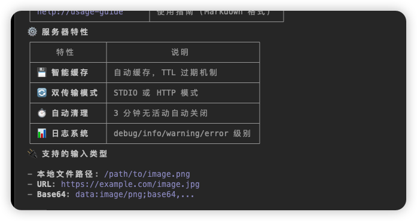
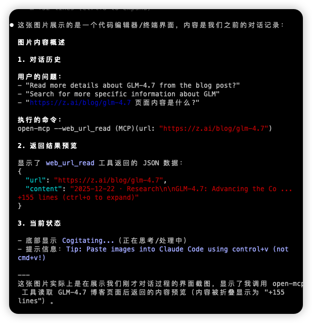

# Open MCP Search Server

[](https://www.npmjs.com/package/@amplify-studio/open-mcp)
[](https://www.npmjs.com/package/@amplify-studio/open-mcp)
[](https://hub.docker.com/r/amplifystudio/open-mcp)
[](https://opensource.org/licenses/MIT)
[](https://github.com/amplify-studio/open-mcp)

Looking for free web search and page reading services? Want better MCP integration? Try this project!

**Doc Language:** [English](README.md) | [中文](readme/zh-CN.md)

Deploy your own local web search and page reading service in one click. Powered by SearXNG and Firecrawl, integrated with Claude via MCP protocol.

## Features

### MCP Tools

Tools provided to AI assistants via MCP protocol:

- 🔍 **Web Search** - Search the web with pagination, time filtering, and language options
- 📄 **URL Reading** - Extract web page content as markdown with advanced filtering
- 🎨 **Image Understanding** - Analyze images, videos, and documents using Zhipu AI (**FREE tier - requires free API key**)
- 🖼️ **Image Generation** - Generate images from text using Zhipu AI (**FREE tier - requires free API key**)

### Server Features

Infrastructure capabilities for deployment and performance:

- 💾 **Smart Caching** - Automatic caching with TTL to improve performance
- 🔄 **Dual Transport** - STDIO or HTTP modes for flexible deployment
- ⏱️ **Auto Cleanup** - Automatic shutdown after 3min of inactivity

### 💰 Free AI Image Features

**The image understanding and generation tools are completely FREE to use!**

Powered by Zhipu AI's generous free tier:
- ✅ **GLM-4.6V-Flash** - Vision understanding model (FREE)
- ✅ **Cogview-3-Flash** - Image generation model (FREE)
- ✅ **No credit card required** - Just register for a free API key
- ✅ **No usage fees** for basic personal usage
- ✅ **Rate limits**: ~5 concurrent requests for free tier ([details](https://www.bigmodel.cn/dev/howuse/rate-limits))

Just get a free API key from [Zhipu AI](https://www.bigmodel.cn/invite?icode=yn2yXKXS+Ba1UqrD19VwPwZ3c5owLmCCcMQXWcJRS8E=) and you're ready to go!

---

## Compatible Clients

Works with any MCP client:

- **Claude Desktop** / **Claude Code** / **Cursor** / **Cline**
- **Continue.dev**
- **HTTP Mode** (for remote deployment)

---

## Quick Start

The quickest way to get started is using the `claude mcp add` command - npx automatically handles downloading and running the server.

### Prerequisites & Setup

Choose your usage mode and follow the corresponding setup:

#### Mode 1: AI-Only (No Docker Required)

**Prerequisites:** None beyond installation

**Get FREE API Key:** See [Getting Zhipu AI API Key](#getting-zhipu-ai-api-key) below

**Setup:**
```bash
claude mcp add-json -s user open-mcp '{
  "command": "npx",
  "args": ["-y", "@amplify-studio/open-mcp@latest"],
  "env": {
    "ZHIPUAI_API_KEY": "your-zhipu-api-key"
  }
}'
```

**Available Tools:** `image_understand`, `image_generate`

#### Mode 2: Search & URL Reading

**Prerequisites:** Running Gateway API instance

**Setup Gateway:**
```bash
# Clone the repository
git clone https://github.com/amplify-studio/open-mcp.git
cd open-mcp

# Start the Gateway services
docker compose --env-file .env up -d

# Verify it's running
curl http://localhost:80/health
```

**Setup MCP:**
```bash
claude mcp add-json -s user open-mcp '{
  "command": "npx",
  "args": ["-y", "@amplify-studio/open-mcp@latest"],
  "env": {
    "GATEWAY_URL": "http://127.0.0.1:80"
  }
}'
```

**Available Tools:** `searxng_web_search`, `web_url_read`

#### Mode 3: Full Features (Search + AI)

**Prerequisites:** Running Gateway + Zhipu AI API Key
- **Get FREE API Key:** See [Getting Zhipu AI API Key](#getting-zhipu-ai-api-key) below
- **Deploy Gateway:** Follow steps in Mode 2

**Setup:**
```bash
claude mcp add-json -s user open-mcp '{
  "command": "npx",
  "args": ["-y", "@amplify-studio/open-mcp@latest"],
  "env": {
    "GATEWAY_URL": "http://127.0.0.1:80",
    "ZHIPUAI_API_KEY": "your-zhipu-api-key"
  }
}'
```

**Available Tools:** All 4 tools

**Gateway Services:**

| Service | Purpose | Port |
|---------|---------|------|
| **SearXNG** | Privacy-respecting metasearch engine | 8888 (internal) |
| **Firecrawl API** | Web scraping and crawling | 3002 (internal) |
| **Playwright** | Browser automation | 3000 (internal) |
| **Reader Adapter** | Jina Reader compatible API | 8082 (internal) |
| **Redis** | Rate limiting and caching | 6379 (internal) |
| **PostgreSQL** | Data persistence | 5432 (internal) |
| **Nginx** | API gateway (public endpoint) | **80** |

**API Endpoints (via Nginx on port 80):**
- 🔍 **Search:** `http://localhost:80/api/search/`
- 📄 **Read URL:** `http://localhost:80/api/read/<url>`
- 📊 **Status:** `http://localhost:80/api/status`

**Management:**
```bash
# View logs
docker compose logs -f

# Stop services
docker compose down

# Restart services
docker compose restart
```

### Basic Usage (Configuration File)

For Claude Desktop, add to your configuration file (`claude_desktop_config.json`):

**AI-Only Mode:**
```json
{
  "mcpServers": {
    "open-mcp": {
      "command": "npx",
      "args": ["-y", "@amplify-studio/open-mcp@latest"],
      "env": {
        "ZHIPUAI_API_KEY": "your-zhipu-api-key"
      }
    }
  }
}
```

**Full Mode:**
```json
{
  "mcpServers": {
    "open-mcp": {
      "command": "npx",
      "args": ["-y", "@amplify-studio/open-mcp@latest"],
      "env": {
        "GATEWAY_URL": "http://your-gateway.com:80",
        "ZHIPUAI_API_KEY": "your-zhipu-api-key"
      }
    }
  }
}
```

---

## Usage

### Web Search Tool

**Tool Name:** `searxng_web_search`

**Parameters:**
- `query` (string, required): The search query
- `limit` (number, optional): Maximum results (1-100, default: 10)

**Example:**

```json
{
  "query": "Model Context Protocol",
  "limit": 5
}
```

**Response:**

```json
{
  "query": "Model Context Protocol",
  "results": [
    {
      "title": "Result Title",
      "content": "Description or snippet...",
      "url": "https://example.com"
    }
  ],
  "totalCount": 5,
  "duration": "234ms"
}
```

### URL Reading Tool

**Tool Name:** `web_url_read`

**Parameters:**
- `url` (string, required): The URL to fetch
- `startChar` (number, optional): Starting character position (default: 0)
- `maxLength` (number, optional): Maximum characters to return
- `section` (string, optional): Extract content under specific heading
- `paragraphRange` (string, optional): Paragraph range like '1-5', '3', '10-'
- `readHeadings` (boolean, optional): Return only headings (default: false)

**Example:**

```json
{
  "url": "https://example.com/article",
  "maxLength": 5000,
  "section": "Introduction"
}
```

**Response:**

```json
{
  "url": "https://example.com/article",
  "content": "# Article Content\n\n...",
  "charCount": 1500,
  "duration": "456ms",
  "cached": false
}
```

### Image Understanding Tool

**Tool Name:** `image_understand`

**Parameters:**
- `files` (array, required): File paths, URLs, or base64 data
- `prompt` (string, required): Question or instruction
- `thinking` (boolean, optional): Enable deep thinking mode

**Example:**

```json
{
  "files": ["/path/to/image.png"],
  "prompt": "What objects are in this image?",
  "thinking": false
}
```

**Response:** Text description or answer

### Image Generation Tool

**Tool Name:** `image_generate`

**Parameters:**
- `prompt` (string, required): Image description
- `size` (string, optional): Image size (default: "1024x1024")

**Example:**

```json
{
  "prompt": "A beautiful sunset over mountains",
  "size": "1024x1024"
}
```

**Response:** Image URL

---

## Feature Showcase

### Image Understanding Example

Our image understanding feature is powered by Zhipu AI GLM-4.6V-Flash, capable of accurately analyzing images, videos, and documents.

**Original Image:**



**AI Understanding Result:**



For more details about image features, see [Image AI Tools Documentation](./docs/features/image-ai-tools.md)

---

## Configuration

### Flexible Configuration

The MCP server automatically detects which features are enabled based on your environment variables. You only need to configure what you use!

#### Configuration Modes

| Mode | Environment Variables | Available Tools | Docker Required |
|------|----------------------|-----------------|-----------------|
| **AI-Only** | `ZHIPUAI_API_KEY` only | `image_understand`, `image_generate` | ❌ No |
| **Search-Only** | `GATEWAY_URL` only | `searxng_web_search`, `web_url_read` | ✅ Yes |
| **Full Mode** | Both variables | All 4 tools | ✅ Yes |

#### Environment Variables

| Variable | Required | Description |
|----------|----------|-------------|
| `GATEWAY_URL` | Optional | Your Gateway API URL (e.g., `http://your-gateway.com:80`). Required for search and URL reading features. |
| `ZHIPUAI_API_KEY` | Optional | Your Zhipu AI API key. Required for image understanding and generation features. |

**Note:** Neither variable is strictly required. The server will automatically enable only the tools for which you've configured dependencies.

**Need advanced configuration?** See [Advanced Setup Guide](docs/advanced-setup.md) for proxy, authentication, and HTTP transport options.

### Getting Zhipu AI API Key

To use image understanding and generation features, you need a free API key from Zhipu AI:

1. **Register with Invite Link**: [https://www.bigmodel.cn/invite?icode=yn2yXKXS+Ba1UqrD19VwPwZ3c5owLmCCcMQXWcJRS8E=](https://www.bigmodel.cn/invite?icode=yn2yXKXS+Ba1UqrD19VwPwZ3c5owLmCCcMQXWcJRS8E=)
   - Use the invite link for better benefits

2. **Get API Key**:
   - After registration, visit [API Keys page](https://www.bigmodel.cn/usercenter/proj-mgmt/apikeys)
   - Click "生成新的 API Key" (Generate new API key)
   - Copy the generated key (format: `id.secret`)

3. **Free Tier Benefits**:
   - GLM-4.6V-Flash: Free for vision understanding
   - Cogview-3-Flash: Free for image generation
   - No credit card required for basic usage

4. **Set Environment Variable**:
   ```bash
   export ZHIPUAI_API_KEY="your-api-key-here"
   ```

**Note**: The API key is optional. Only required if you want to use image understanding or generation features.

---

## HTTP Transport Mode

The server supports HTTP transport for remote deployment. See [Advanced Setup Guide](docs/advanced-setup.md#http-transport-mode) for detailed instructions.

**Quick Start**:
```bash
MCP_HTTP_PORT=3333 GATEWAY_URL=http://your-gateway.com:80 npx @amplify-studio/open-mcp@latest
```

Then connect from Claude Code:
```bash
claude mcp add --transport http open-mcp http://localhost:3333/mcp
```

## Development

### Setup

```bash
# Install dependencies
npm install

# Development mode with file watching
npm run watch

# Run tests
npm test

# Generate coverage report
npm run test:coverage

# Test with MCP Inspector
npm run inspector

# Build for production
npm run build
```

### Testing

```bash
# Run all tests
npm test

# Run coverage report
npm run test:coverage

# Test specific file
npx tsx __tests__/unit/search.test.ts
```

## Updating

### Using Claude CLI

```bash
# Remove old version
claude mcp remove open-mcp

# Install latest version
claude mcp add-json -s user open-mcp '{
  "command": "npx",
  "args": ["-y", "@amplify-studio/open-mcp@latest"],
  "env": {
    "GATEWAY_URL": "https://your-gateway-instance.com",
    "ZHIPUAI_API_KEY": "your-zhipu-api-key"
  }
}'
```

### Clear npx Cache

If you encounter issues after updating:

```bash
npm cache clean --force
claude mcp remove open-mcp
claude mcp add-json -s user open-mcp '{
  "command": "npx",
  "args": ["-y", "@amplify-studio/open-mcp@latest"],
  "env": {
    "GATEWAY_URL": "https://your-gateway-instance.com",
    "ZHIPUAI_API_KEY": "your-zhipu-api-key"
  }
}'
```

## Contributing

We welcome contributions! Please follow these guidelines:

- Fork the repository
- Create a feature branch
- Make your changes
- Submit a pull request

### Coding Standards

- Use TypeScript with strict type safety
- Follow existing error handling patterns
- Write concise, informative error messages
- Include unit tests for new functionality
- Maintain 90%+ test coverage

## License

MIT License - see [LICENSE](LICENSE) for details.

## Credits & Acknowledgments

This project is a fork of [mcp-searxng](https://github.com/ihor-sokoliuk/mcp-searxng) by [Ihor Sokoliuk](https://github.com/ihor-sokoliuk), adapted and enhanced with additional features and improvements.

### Key Dependencies

This project is built upon these excellent open-source projects:

| Project | Purpose | License |
|---------|---------|---------|
| [@modelcontextprotocol/sdk](https://github.com/modelcontextprotocol/typescript-sdk) | Official MCP TypeScript SDK | MIT |
| [node-html-markdown](https://github.com/crosstype/node-html-markdown) | HTML to Markdown conversion | MIT |
| [undici](https://github.com/nodejs/undici) | HTTP client with proxy support | MIT |
| [express](https://github.com/expressjs/express) | HTTP server framework | MIT |
| [cors](https://github.com/expressjs/cors) | CORS middleware | MIT |

### Related Projects

Special thanks to these amazing projects:

- [mcp-searxng](https://github.com/ihor-sokoliuk/mcp-searxng) - Original project that we forked from, created by [Ihor Sokoliuk](https://github.com/ihor-sokoliuk)
- [Model Context Protocol](https://modelcontextprotocol.io/) - Official MCP documentation
- [SearXNG](https://searxng.org/) - Privacy-respecting metasearch engine
- [Firecrawl](https://www.firecrawl.dev/) - Web scraping and crawling API

### Powered By

| Feature | Technology |
|---------|------------|
| **Search** | [SearXNG](https://searxng.org/) - Privacy-respecting metasearch engine |
| **Web Scraping** | [Firecrawl](https://www.firecrawl.dev/) - Web scraping API |
| **Image AI** | [Zhipu AI](https://open.bigmodel.cn/) - Free tier for vision models |
| **Protocol** | [MCP SDK](https://github.com/modelcontextprotocol/typescript-sdk) - Official implementation |

---

## Star History

[](https://star-history.com/#amplify-studio/open-mcp&Date)


**Made with ❤️ by [Amplify Studio](https://github.com/amplify-studio)**
