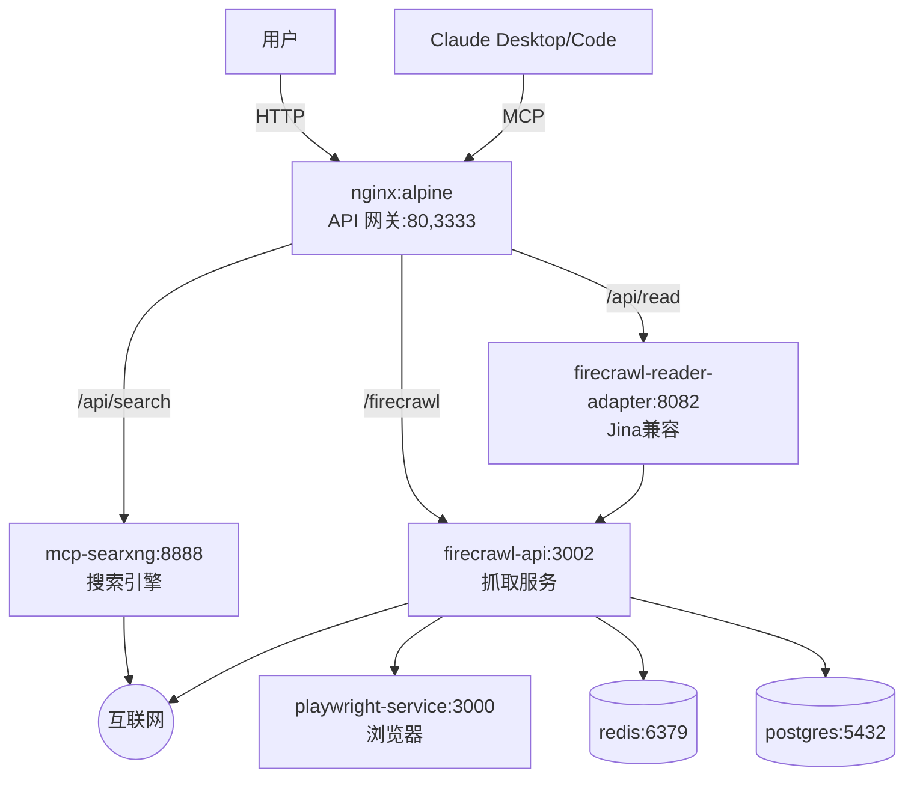

# Open MCP Search Server

[](https://www.npmjs.com/package/@amplify-studio/open-mcp)
[](https://www.npmjs.com/package/@amplify-studio/open-mcp)
[](https://hub.docker.com/r/amplifystudio/open-mcp)
[](https://opensource.org/licenses/MIT)
[](https://github.com/amplify-studio/open-mcp)

想找免费的搜索和页面读取服务？想要更好的 MCP 接入？来试试这个项目吧！

**语言：** [English](../README.md) | [中文](README.md)

一键部署您自己的本地搜索和页面读取服务。由 SearXNG 和 Firecrawl 提供支持，通过 MCP 协议与 Claude 集成。

Deploy your own local web search and page reading service in one click. Powered by SearXNG and Firecrawl, integrated with Claude via MCP protocol.

## 功能特性

### MCP 工具 / MCP Tools

通过 MCP 协议提供给 AI 助手的工具：

- 🔍 **网络搜索** - 支持分页、时间过滤、语言选择的网络搜索
- 📄 **URL 读取** - 将网页内容提取为 markdown，支持高级过滤
- 🎨 **图像理解** - 使用智谱 AI 分析图像、视频和文档
- 🖼️ **图像生成** - 使用智谱 AI 从文本生成图像

### 服务器特性 / Server Features

部署和性能相关的基础设施功能：

- 💾 **智能缓存** - 自动缓存，TTL 过期机制提高性能
- 🔄 **双传输模式** - 支持 STDIO 或 HTTP 模式灵活部署
- 🌐 **代理支持** - 内置代理配置，支持 NO_PROXY 绕过

### 技术支持 / Powered By

| 功能 | 技术支持 |
|---------|------------|
| 搜索 | [SearXNG](https://searxng.org/) - 尊重隐私的元搜索引擎 |
| 抓取 | [Firecrawl](https://www.firecrawl.dev/) - 网页抓取 API |
| 图像 AI | [智谱 AI](https://open.bigmodel.cn/) - 免费视觉模型 |
| 协议 | [MCP SDK](https://github.com/modelcontextprotocol/typescript-sdk) - 官方实现 |

---

## 兼容客户端

兼容任何 MCP 客户端：

- **Claude Desktop** / **Claude Code** / **Cursor** / **Cline**
- **Continue.dev**
- **HTTP 模式**（用于远程部署）

---

## 快速开始

### 前置条件

使用本 MCP 服务器前，您需要：

1. **运行中的 Gateway API 实例**，包含 SearXNG 和 Firecrawl
   - 部署您自己的 Gateway 或使用托管服务
   - 获取您的 Gateway URL（例如：`http://your-gateway.com:80`）

2. **（可选）智谱 AI API 密钥**用于图像功能
   - 参见下方的[获取智谱 AI API 密钥](#获取智谱-api-密钥)

### 基本使用

添加到 Claude Desktop 配置文件（`claude_desktop_config.json`）：

```json
{
  "mcpServers": {
    "open-mcp": {
      "command": "npx",
      "args": ["-y", "@amplify-studio/open-mcp@latest"],
      "env": {
        "GATEWAY_URL": "http://your-gateway.com:80",
        "ZHIPUAI_API_KEY": "your-zhipu-api-key"
      }
    }
  }
}
```

**替换以下值：**
- `http://your-gateway.com:80` 替换为您的实际 Gateway URL（**必需**）
- `your-zhipu-api-key` 替换为您的智谱 AI API 密钥（**可选** - 仅在需要图像功能时必需）

---

## 功能特性

### MCP 工具 / MCP Tools

通过 MCP 协议提供给 AI 助手的工具：

- 🔍 **网络搜索** - 支持分页、时间过滤、语言选择的网络搜索
- 📄 **URL 读取** - 将网页内容提取为 markdown，支持高级过滤
- 🎨 **图像理解** - 使用智谱 AI 分析图像、视频和文档
- 🖼️ **图像生成** - 使用智谱 AI 从文本生成图像

### 服务器特性 / Server Features

部署和性能相关的基础设施功能：

- 💾 **智能缓存** - 自动缓存，TTL 过期机制提高性能
- 🔄 **双传输模式** - 支持 STDIO 或 HTTP 模式灵活部署
- 🌐 **代理支持** - 内置代理配置，支持 NO_PROXY 绕过

### 技术支持 / Powered By

| 功能 | 技术支持 |
|---------|------------|
| 搜索 | [SearXNG](https://searxng.org/) - 尊重隐私的元搜索引擎 |
| 抓取 | [Firecrawl](https://www.firecrawl.dev/) - 网页抓取 API |
| 图像 AI | [智谱 AI](https://open.bigmodel.cn/) - 免费视觉模型 |
| 协议 | [MCP SDK](https://github.com/modelcontextprotocol/typescript-sdk) - 官方实现 |

---

## 兼容客户端

兼容任何 MCP 客户端，包括：
- **Claude Desktop** / **Claude Code** / **Cursor** / **Cline**
- **Continue.dev**
- **HTTP 模式**（用于远程部署）

### 安装

#### 使用 Claude CLI（推荐）

```bash
claude mcp add-json -s user open-mcp '{
  "command": "npx",
  "args": ["-y", "@amplify-studio/open-mcp@latest"],
  "env": {
    "GATEWAY_URL": "https://your-gateway-instance.com",
    "ZHIPUAI_API_KEY": "your-zhipu-api-key"
  }
}'
```

#### 使用 Claude Desktop 配置

编辑 `claude_desktop_config.json`：

```json
{
  "mcpServers": {
    "open-mcp": {
      "command": "npx",
      "args": ["-y", "@amplify-studio/open-mcp@latest"],
      "env": {
        "GATEWAY_URL": "https://your-gateway-instance.com",
        "ZHIPUAI_API_KEY": "your-zhipu-api-key"
      }
    }
  }
}
```

#### 使用 Continue.dev

添加到您的 `config.json`：

```json
{
  "mcpServers": {
    "open-mcp": {
      "command": "npx",
      "args": ["-y", "@amplify-studio/open-mcp@latest"],
      "env": {
        "GATEWAY_URL": "https://your-gateway-instance.com",
        "ZHIPUAI_API_KEY": "your-zhipu-api-key"
      }
    }
  }
}
```

**注意**：将 `https://your-gateway-instance.com` 替换为您的 Gateway URL（必需），将 `your-zhipu-api-key` 替换为您的智谱 API 密钥（可选）。

#### HTTP 模式

```bash
# 启动 HTTP 服务器
MCP_HTTP_PORT=3333 GATEWAY_URL=https://your-gateway-instance.com npx @amplify-studio/open-mcp@latest

# 从 Claude Code 连接
claude mcp add --transport http open-mcp http://localhost:3333/mcp
```

## 使用方法

### 网络搜索工具

**工具名称：** `searxng_web_search`

**参数：**
- `query` (string, required): 搜索查询
- `limit` (number, optional): 最大结果数（1-100，默认：10）

**示例：**

```json
{
  "query": "Model Context Protocol",
  "limit": 5
}
```

**响应：**

```json
{
  "query": "Model Context Protocol",
  "results": [
    {
      "title": "Result Title",
      "content": "Description or snippet...",
      "url": "https://example.com"
    }
  ],
  "totalCount": 5,
  "duration": "234ms"
}
```

### URL 读取工具

**工具名称：** `web_url_read`

**参数：**
- `url` (string, required): 要获取的 URL
- `startChar` (number, optional): 起始字符位置（默认：0）
- `maxLength` (number, optional): 要返回的最大字符数
- `section` (string, optional): 提取特定标题下的内容
- `paragraphRange` (string, optional): 段落范围，如 '1-5'、'3'、'10-'
- `readHeadings` (boolean, optional): 仅返回标题（默认：false）

**示例：**

```json
{
  "url": "https://example.com/article",
  "maxLength": 5000,
  "section": "Introduction"
}
```

**响应：**

```json
{
  "url": "https://example.com/article",
  "content": "# Article Content\n\n...",
  "charCount": 1500,
  "duration": "456ms",
  "cached": false
}
```

### 图片理解工具 / Image Understanding Tool

**工具名称：** `image_understand`

**参数：**
- `files` (array, required): 文件路径、URL 或 base64 数据
- `prompt` (string, required): 问题或指令
- `thinking` (boolean, optional): 启用深度思考模式

**示例：**

```json
{
  "files": ["/path/to/image.png"],
  "prompt": "这张图片里有什么物体？",
  "thinking": false
}
```

**响应：** 文本描述或答案

### 图片生成工具 / Image Generation Tool

**工具名称：** `image_generate`

**参数：**
- `prompt` (string, required): 图片描述
- `size` (string, optional): 图片大小（默认："1024x1024"）

**示例：**

```json
{
  "prompt": "山上美丽的日落",
  "size": "1024x1024"
}
```

**响应：** 图片 URL

## 配置

### 必需的环境变量

| 变量 | 描述 |
|---------|-------------------|
| `GATEWAY_URL` | **必需。** 您的 Gateway API 地址（例如：`http://your-gateway.com:80`） |

### 可选的环境变量

| 变量 | 描述 |
|---------|-------------------|
| `ZHIPUAI_API_KEY` | 可选。仅在需要图像理解/生成功能时必需 |

**需要高级配置？** 查看 [高级配置指南](docs/advanced-setup-zh.md) 了解代理、认证和 HTTP 传输等选项。

### 获取智谱 AI API 密钥

要使用图像理解和生成功能，您需要从智谱 AI 获取免费的 API 密钥：

1. **通过邀请链接注册**: [https://www.bigmodel.cn/invite?icode=yn2yXKXS+Ba1UqrD19VwPwZ3c5owLmCCcMQXWcJRS8E=](https://www.bigmodel.cn/invite?icode=yn2yXKXS+Ba1UqrD19VwPwZ3c5owLmCCcMQXWcJRS8E=)
   - 使用邀请链接注册可获得更多权益

2. **获取 API 密钥**:
   - 注册后，访问 [API Keys 页面](https://www.bigmodel.cn/usercenter/proj-mgmt/apikeys)
   - 点击"生成新的 API Key"
   - 复制生成的密钥（格式：`id.secret`）

3. **免费额度说明**:
   - GLM-4.6V-Flash: 视觉理解免费使用
   - Cogview-3-Flash: 图像生成免费使用
   - 基础使用无需绑定银行卡

4. **设置环境变量**:
   ```bash
   export ZHIPUAI_API_KEY="your-api-key-here"
   ```

**注意**: API 密钥是可选的。只有在需要使用图像理解或生成功能时才必需。

---

## 安装方法

### 选项 1: NPX（推荐）

```bash
npx -y @amplify-studio/open-mcp@latest
```

### 选项 2: 全局安装

```bash
npm install -g @amplify-studio/open-mcp
mcp-searxng
```

### 选项 3: Docker

#### 使用预构建镜像

```bash
docker pull amplifystudio/open-mcp:latest
```

```json
{
  "mcpServers": {
    "open-mcp": {
      "command": "docker",
      "args": [
        "run", "-i", "--rm",
        "-e", "GATEWAY_URL",
        "-e", "ZHIPUAI_API_KEY",
        "amplifystudio/open-mcp:latest"
      ],
      "env": {
        "GATEWAY_URL": "https://your-gateway-instance.com",
        "ZHIPUAI_API_KEY": "your-zhipu-api-key"
      }
    }
  }
}
```

#### Docker Compose

**Docker Compose 架构 / Architecture:**



**服务概览 / Service Overview:**

| 服务 | 端口 | 用途 |
|---------|------|---------|
| **nginx** | 80, 3333 | API 网关，将请求路由到内部服务 |
| **mcp-searxng** | 8888 | 尊重隐私的元搜索引擎 |
| **firecrawl-reader-adapter** | 8082 | Jina Reader 兼容的 URL 读取 API |
| **firecrawl-api** | 3002 | 带浏览器自动化的网页抓取 API |
| **playwright-service** | 3000 | 用于动态内容的无头浏览器 |
| **redis** | 6379 | 速率限制和缓存 |
| **nuq-postgres** | 5432 | 数据持久化 |

**使用 Docker Compose 快速开始 / Quick Start:**

```yaml
services:
  mcp-searxng:
    image: amplifystudio/open-mcp:latest
    stdin_open: true
    environment:
      - GATEWAY_URL=https://your-gateway-instance.com
      # 根据需要添加可选变量
      # - AUTH_USERNAME=your_username
      # - AUTH_PASSWORD=your_password
```

完整的 7 服务 Docker Compose 部署，请参阅 [docker-compose.yml](https://github.com/amplify-studio/open-mcp/blob/main/docker-compose.yml)。

### 选项 4: 本地开发

```bash
# 克隆仓库
git clone https://github.com/amplify-studio/open-mcp.git
cd open-mcp

# 安装依赖
npm install

# 构建项目
npm run build

# 直接运行
node dist/index.js
```

## HTTP 传输模式

服务器支持用于远程部署的 HTTP 传输。详见 [高级配置指南](docs/advanced-setup-zh.md#http-传输模式)。

**快速开始**:
```bash
MCP_HTTP_PORT=3333 GATEWAY_URL=http://your-gateway.com:80 npx @amplify-studio/open-mcp@latest
```

然后从 Claude Code 连接：
```bash
claude mcp add --transport http open-mcp http://localhost:3333/mcp
```

## 开发

### 设置

```bash
# 安装依赖
npm install

# 带文件监视的开发模式
npm run watch

# 运行测试
npm test

# 生成覆盖率报告
npm run test:coverage

# 使用 MCP Inspector 测试
npm run inspector

# 生产构建
npm run build
```

### 测试

```bash
# 运行所有测试
npm test

# 运行覆盖率报告
npm run test:coverage

# 测试特定文件
npx tsx __tests__/unit/search.test.ts
```

## 更新

### 使用 Claude CLI

```bash
# 移除旧版本
claude mcp remove open-mcp

# 安装最新版本
claude mcp add-json -s user open-mcp '{
  "command": "npx",
  "args": ["-y", "@amplify-studio/open-mcp@latest"],
  "env": {
    "GATEWAY_URL": "https://your-gateway-instance.com",
    "ZHIPUAI_API_KEY": "your-zhipu-api-key"
  }
}'
```

### 清除 npx 缓存

如果更新后遇到问题：

```bash
npm cache clean --force
claude mcp remove open-mcp
claude mcp add-json -s user open-mcp '{
  "command": "npx",
  "args": ["-y", "@amplify-studio/open-mcp@latest"],
  "env": {
    "GATEWAY_URL": "https://your-gateway-instance.com",
    "ZHIPUAI_API_KEY": "your-zhipu-api-key"
  }
}'
```

## 贡献

我们欢迎贡献！请遵循以下准则：

- Fork 仓库
- 创建功能分支
- 进行更改
- 提交 pull request

### 编码标准

- 使用严格类型安全的 TypeScript
- 遵循现有的错误处理模式
- 编写简洁、信息丰富的错误消息
- 为新功能包含单元测试
- 保持 90% 以上的测试覆盖率

## 许可证

MIT 许可证 - 详情见 [LICENSE](../LICENSE)。

## 致谢

本项目是 [mcp-searxng](https://github.com/ihor-sokoliuk/mcp-searxng)（作者 [Ihor Sokoliuk](https://github.com/ihor-sokoliuk)）的衍生版本，进行了适配和增强，添加了额外的功能和改进。

### 核心依赖

本项目构建于以下优秀的开源项目之上：

| 项目 | 用途 | 许可证 |
|---------|---------------|-----------------|
| [@modelcontextprotocol/sdk](https://github.com/modelcontextprotocol/typescript-sdk) | 官方 MCP TypeScript SDK | MIT |
| [node-html-markdown](https://github.com/crosstype/node-html-markdown) | HTML 到 Markdown 转换 | MIT |
| [undici](https://github.com/nodejs/undici) | 支持代理的 HTTP 客户端 | MIT |
| [express](https://github.com/expressjs/express) | HTTP 服务器框架 | MIT |
| [cors](https://github.com/expressjs/cors) | CORS 中间件 | MIT |

### 相关项目

特别感谢以下优秀项目：

- [mcp-searxng](https://github.com/ihor-sokoliuk/mcp-searxng) - 我们 fork 的原始项目，由 [Ihor Sokoliuk](https://github.com/ihor-sokoliuk) 创建
- [Model Context Protocol](https://modelcontextprotocol.io/) - 官方 MCP 文档
- [SearXNG](https://searxng.org/) - 尊重隐私的元搜索引擎
- [Firecrawl](https://www.firecrawl.dev/) - 网页抓取和爬取 API

---

## Star History

[](https://star-history.com/#amplify-studio/open-mcp&Date)

---

**由 [Amplify Studio](https://github.com/amplify-studio) 用 ❤️ 制作**
